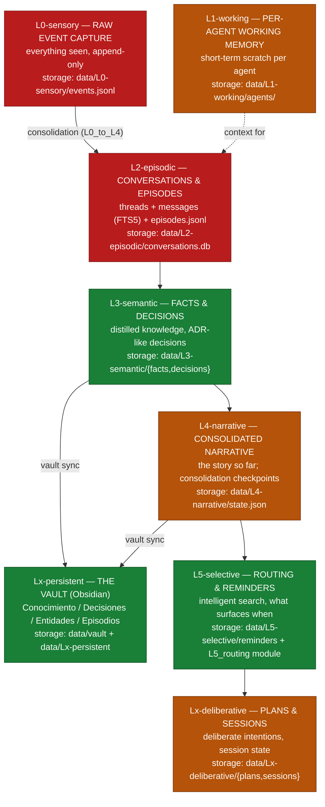
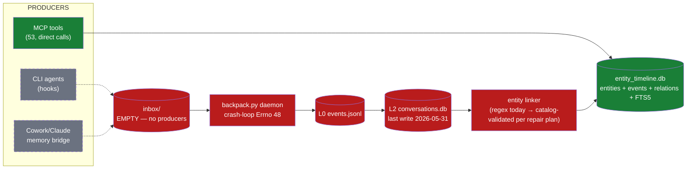
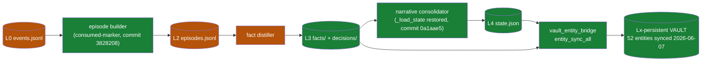
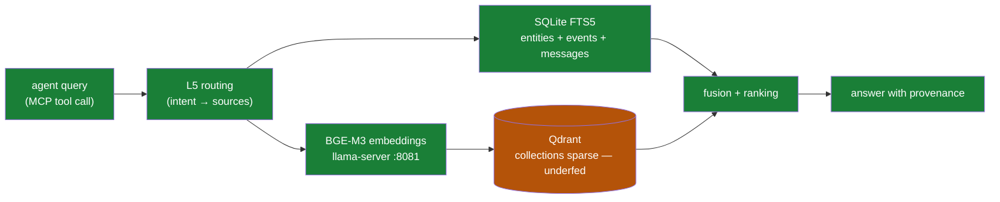

# The Memory Stack — Levels, Flows and Legend

> Source of truth: directory layout under `data/` and module wiring in
> `src/unified/server/backpack.py`, verified 2026-06-07. Every node in these
> diagrams exists on disk; status colors reflect the repair plan diagnosis
> (docs/plans/2026-06-07-MEMORY-REPAIR-PLAN.md).

## 1. The stack (8 levels)

Information enters at the bottom (senses) and crystallizes upward into
permanent, human-readable knowledge.

**Color legend** — green: working today · red: BROKEN (no data since
2026-05-31; see repair plan D1-D3) · amber: partially wired (exists on disk,
weak producers/consumers).

## 2. Flow A — Capture (where information enters)

Reading: solid green path (MCP tools → entity timeline) is the ONLY live
entry today — it is how the 2026-06-07 mirrors were written. Everything
through inbox/backpack is red (repair plan Phases 0-1); dashed gray nodes
are the producers Phase 1 adds.

## 3. Flow B — Consolidation (L0 → L4, the dream cycle)

Reading: the machinery was repaired in the May 31 - Jun 6 commit batch
(F-01 fix, consumed-markers) and works when fed — but it starves because
Flow A is dead upstream. Fix capture and this whole pipeline resumes.

## 4. Flow C — Recall (how an agent gets memory back)

## 5. Node legend (every box, one line)

| Node | What it does | Storage | Status |
|---|---|---|---|
| L0-sensory | Append-only raw event log; nothing is interpreted here | data/L0-sensory/events.jsonl | RED — starved |
| L1-working | Per-agent scratchpad for the current task | data/L1-working/agents/ | AMBER |
| L2-episodic | Conversations (threads/messages, FTS5) and episode summaries | data/L2-episodic/ | RED — last write 05-31 |
| L3-semantic | Distilled facts and decisions (the "what we know") | data/L3-semantic/ | GREEN |
| L4-narrative | Consolidated story + consolidation checkpoints | data/L4-narrative/state.json | AMBER |
| L5-selective | Routing: decides which memory surfaces for which query | memory/L5 modules + reminders | GREEN |
| Lx-deliberative | Plans and session intentions (future-facing memory) | data/Lx-deliberative/ | AMBER |
| Lx-persistent | The Obsidian vault — human-readable crystallization | data/vault/ | GREEN |
| inbox/ | File-drop ingestion point for external producers | inbox/ | RED — zero producers |
| backpack.py | The daemon orchestrating ingest + consolidation | src/unified/server/ | RED — port crash-loop |
| entity_timeline.db | Phone book + timelines + relations (ADR-001 metadata) | data/entity_timeline.db | GREEN |
| BGE-M3 + Qdrant | Semantic similarity for recall and dedup | :8081 + qdrant/ | AMBER — underfed |

> Update discipline: when a repair-plan phase lands, flip the affected node
> colors in the SAME commit. A diagram that lies is worse than no diagram.
